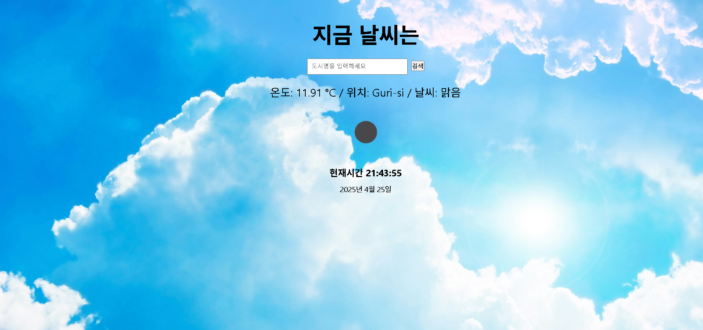

# 🐣 WEATHER GPS

**🚀 배포 링크**: [weather gps 바로가기](https://lively-sunflower-727a6f.netlify.app/)

날씨API를 이용한 날씨GPS 앱입니다.

 
  
 

## 사용 기술

- React
- OpenWeatherMap API (Weather API)
- 시간 관리 함수
- 현재 위치를 받는 함수

## 주요 기능

- Weather API를 이용한 날씨 정보 받아오기
- 현재 위치의 날씨, 날씨 아이콘, 현재 시간 및 날짜 표시
- 1초 단위로 시간 진행하여 실시간으로 시간과 날짜 표시
