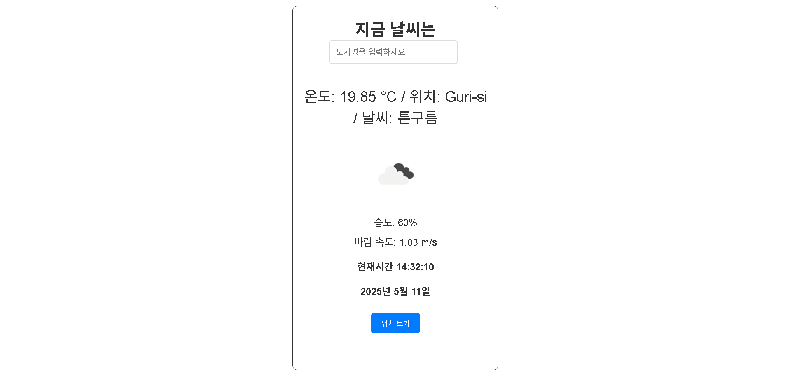

# 🌦️ WEATHER GPS

[](https://lively-sunflower-727a6f.netlify.app/)

**🔗 배포 링크**: [https://lively-sunflower-727a6f.netlify.app/](https://lively-sunflower-727a6f.netlify.app/)

OpenWeatherMap API와 브라우저의 위치 정보를 이용하여 현재 위치 기반 실시간 날씨와 시간을 제공하는 날씨 앱입니다.



---

## 🚀 주요 기능

- 📍 **현재 위치 기반 날씨 정보 표시**
- 🕐 **1초 단위로 실시간 시간 및 날짜 갱신**
- 🌤️ **날씨 상태 및 아이콘 표시**
- 🌡️ **온도 및 위치 정보 시각화**

---

## 🛠️ 사용 기술

- ⚛️ **React** - SPA 구성
- 📡 **OpenWeatherMap API** - 날씨 데이터 호출
- 🧭 **Geolocation API** - 사용자의 현재 위치 받아오기
- ⏱️ **JavaScript 시간 함수** - 실시간 시계 구현

---

## 📁 프로젝트 구조

```
├── public/
├── src/
│   ├── components/         # 날씨 및 시계 컴포넌트
│   ├── hooks/              # 커스텀 훅 (예: 위치 가져오기)
│   └── App.js              # 앱 진입점
├── package.json
├── weather.png             # 대표 이미지
└── README.md
```

---

## ⚙️ 설치 및 실행 방법

```bash
# 1. 저장소 클론
git clone https://github.com/your-username/weather-gps.git

# 2. 디렉토리 이동
cd weather-gps

# 3. 패키지 설치
npm install

# 4. 앱 실행
npm start
```

---

## 📌 참고

- 날씨 API Key는 `.env` 파일 등을 통해 관리하면 보안에 좋습니다.
- 위치 정보 접근 권한이 필요합니다.

---

## 📜 라이선스

MIT License
